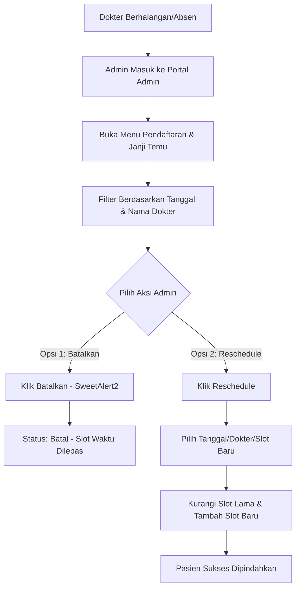

# Panduan Logika Bisnis & Presentasi Sidang UAS — SIMRS MiraCare

Dokumen ini disusun khusus sebagai panduan komprehensif untuk menjelaskan **Logika Sistem** dan **Alur Transaksional** dari SIMRS MiraCare saat presentasi di hadapan Dosen Penguji Ujian Akhir Semester (UAS). Dokumen ini berfokus pada pertanggungjawaban logika teknis dan penyelesaian skenario dunia nyata.

---

## 📌 DAFTAR ISI
1. [Logika Inti Sistem (Core Engine)](#1-logika-inti-sistem-core-engine)
2. [Skenario 1 — Penanganan Dokter Berhalangan / Reschedule (Baru!)](#2-skenario-1--penanganan-dokter-berhalangan--reschedule-baru)
3. [Skenario 2 — Pendaftaran Pasien Langsung / Walk-In (Baru!)](#3-skenario-2--pendaftaran-pasien-langsung--walk-in-baru)
4. [Logika Fitur Transaksional Lainnya](#4-logika-fitur-transaksional-lainnya)
5. [Tips & Trik Menghadapi Pertanyaan Dosen Penguji](#5-tips--trik-menghadapi-pertanyaan-dosen-penguji)

---

## 🛠 1. LOGIKA INTI SISTEM (CORE ENGINE)

### 1.1 Penentuan Slot Waktu & Kuota Dokter
* **Logika Teknis:** Kuota pendaftaran dihitung per **Slot Waktu (per jam)**, bukan per hari. Setiap dokter memiliki data `jam_mulai`, `jam_selesai`, dan `kuota_per_slot` di tabel `tbl_dokter`.
* **Proses Query:**
  - Sistem membuat slot dari `jam_mulai` hingga `jam_selesai` (misalnya: `08:00`, `09:00`, `10:00`).
  - Untuk setiap slot, sistem melakukan query ke tabel `tbl_slot_booking` untuk melihat `jumlah_terisi`.
  - Jika `jumlah_terisi` >= `kuota_per_slot`, slot tersebut ditandai **Penuh (Disabled & Berwarna Merah)** di sisi pasien.
* **Keunggulan untuk Sidang:** Mencegah penumpukan pasien di jam yang sama (anti-antrean panjang). Ini jauh lebih realistis daripada kuota harian biasa.

### 1.2 Aturan Pencegahan Penyalahgunaan Sesi (Anti-Spam & Penalty)
Sistem menerapkan **2 sanksi otomatis** untuk mencegah pasien merusak jadwal klinik:
1. **Batas Booking Aktif (Maksimal 3):** Pasien tidak boleh memiliki lebih dari 3 janji temu berstatus `'Belum Diperiksa'` / `'Sedang Diperiksa'` sekaligus.
2. **Sanksi No-Show (Tidak Hadir):** Jika pasien memiliki riwayat `'Tidak Hadir'` sebanyak 3 kali (terdeteksi otomatis saat tanggal janji temu terlewati tanpa pemeriksaan), akun pasien **ditangguhkan sementara** dan tidak bisa melakukan booking online sampai diklarifikasi oleh Admin.

---

## ⚠️ 2. SKENARIO 1 — PENANGANAN DOKTER BERHALANGAN / RESCHEDULE

### ❓ Masalah Dunia Nyata
Bagaimana jika dr. Lestari Ningrum mendadak sakit di hari Selasa, padahal sudah ada 10 pasien yang membooking jadwal beliau pada hari tersebut?

### 🏥 Penyelesaian di Rumah Sakit Asli
1. **Kunci Slot:** Admisi segera menutup slot booking dr. Lestari agar tidak ada pendaftar baru.
2. **Kontak & Pengalihan:** Bagian pelayanan pelanggan menghubungi pasien untuk memindahkan jadwal (*reschedule*) ke hari lain atau mengalihkan ke *dokter pengganti* di poli yang sama hari itu.
3. **Pencatatan Status:** Status diubah untuk keperluan audit data internal.

### 💻 Solusi Teknis & Alur Kerja SIMRS MiraCare
Sistem menangani ini secara elegan melalui **Portal Admin** pada menu **"Pendaftaran & Janji Temu"**:


* **Transaksi Database Reschedule (`AdminController::reschedulePendaftaran`):**
  Untuk menjamin integritas kuota, pemindahan jadwal dilakukan dalam satu transaksi database (`transStart()` & `transComplete()`):
  ```sql
  -- Langkah A: Kurangi jumlah_terisi pada slot lama
  UPDATE tbl_slot_booking SET jumlah_terisi = jumlah_terisi - 1 
  WHERE id_dokter = OLD_DOC AND tgl_booking = OLD_DATE AND slot_waktu = OLD_SLOT;

  -- Langkah B: Tambah jumlah_terisi pada slot baru (atau insert jika belum ada)
  INSERT INTO tbl_slot_booking (id_dokter, tgl_booking, slot_waktu, jumlah_terisi) 
  VALUES (NEW_DOC, NEW_DATE, NEW_SLOT, 1)
  ON DUPLICATE KEY UPDATE jumlah_terisi = jumlah_terisi + 1;

  -- Langkah C: Perbarui data janji temu pasien
  UPDATE tbl_pendaftaran SET id_dokter = NEW_DOC, tgl_daftar = NEW_DATE, slot_waktu = NEW_SLOT...;
  ```

---

## 🚶‍♂️ 3. SKENARIO 2 — PENDAFTARAN PASIEN LANGSUNG / WALK-IN

### ❓ Masalah Dunia Nyata
Seorang pasien lansia datang langsung ke rumah sakit (*walk-in/on-site*) tanpa melakukan booking online di website. Apakah pasien harus langsung mengetuk pintu dokter?

### 🏥 Penyelesaian di Rumah Sakit Asli
1. **Wajib ke Admisi:** Pasien *tidak boleh* langsung ke dokter. Pasien wajib menuju **Loket Admisi / Pendaftaran** di lobi utama.
2. **Verifikasi RM:** Staf mengecek apakah pasien sudah punya nomor Rekam Medis (RM) atau harus dibuatkan baru.
3. **Pemberian Antrean:** Admin mendaftarkan pasien ke dalam SIMRS dan mencetak nomor antrean poli tujuan.

### 💻 Solusi Teknis & Alur Kerja SIMRS MiraCare
Sistem menyelesaikan ini dengan menyediakan formulir **"Pendaftaran Walk-In"** khusus di **Portal Admin**:
1. Pasien dilayani di loket. Staf Admin membuka Portal Admin -> Menu **Pendaftaran & Janji Temu**.
2. Klik tombol **`[Pendaftaran Baru (Walk-in)]`**.
3. Admin memilih Nama Pasien dari dropdown (pencarian instan), memilih Poliklinik, dan Dokter yang dituju.
4. **AJAX Terpadu:** Sistem secara dinamis memuat daftar dokter aktif dan sisa slot waktu secara real-time pada tanggal tersebut dengan memanggil endpoint AJAX yang aman.
5. Setelah disimpan, data dimasukkan ke `tbl_pendaftaran` dengan status awal `"Belum Diperiksa"`.
6. **Penyatuan Antrean:** Nomor antrean walk-in ini **otomatis menyatu** secara kronologis dengan antrean booking online dalam antrean dokter pada hari tersebut. Dokter di ruang periksa hanya perlu melihat satu daftar urutan panggil terpadu di layar komputernya!

### 🔒 3.1 Integritas NIK & Sistem Validasi Duplikasi Real-time (Baru!)
Untuk mencegah data pasien ganda di database (*duplicate medical record*), sistem menerapkan keamanan dua lapis saat Admin menambahkan atau mengedit pasien:
* **Lapis 1 (Real-time Client-side AJAX):** Ketika Admin selesai mengetik 16 digit NIK pada form tambah/edit pasien, JavaScript langsung mengirim request ke AJAX endpoint `admin/pasien/cek-nik`. 
  - Jika **terdaftar**, sistem menampilkan pesan merah *“NIK terdaftar atas nama [Nama] ([No. RM])”* dan **mengunci tombol submit secara otomatis** (`disabled`).
  - Jika **tersedia**, sistem menampilkan pesan hijau berikon centang dan tombol submit diaktifkan.
* **Lapis 2 (Backend Validation):** Di sisi server ([AdminController.php](file:///c:/xampp/htdocs/simrs/app/Controllers/AdminController.php)), database melakukan pengecekan ulang sebelum eksekusi `INSERT`/`UPDATE` untuk menjamin tidak ada celah bypass.

### 🔄 3.2 Alur Aktivasi Akun Online Pasien Mandiri (Alur Offline-to-Online)
Skenario: Pasien lama yang didaftarkan offline oleh Admin ingin mendaftar online sendiri di rumah agar bisa melakukan booking rawat jalan.
* **Jebakan Logika Umum:** Jika sistem hanya mengecek keunikan NIK secara kaku, pendaftaran mandiri pasien lama akan **terblokir** selamanya karena NIK mereka sudah ada di database, padahal mereka belum memiliki akun user online.
* **Solusi Pintar SIMRS MiraCare ([AuthController.php](file:///c:/xampp/htdocs/simrs/app/Controllers/AuthController.php)):**
  1. Pasien lama melakukan registrasi di menu Register website.
  2. Sistem mengecek NIK. Jika NIK **sudah ada di `tbl_pasien`** tetapi **kolom `id_user` masih kosong (NULL)**:
     - Sistem **tidak memblokir** pasien.
     - Sistem membuat akun user baru di `tbl_user` (level 'Pasien').
     - Sistem **memperbarui (`update`)** data rekam medis `tbl_pasien` yang ada dengan menghubungkannya ke `id_user` baru tersebut.
     - Nomor Rekam Medis (RM) pasien **tetap dipertahankan** tanpa membuat rekam medis ganda.
  3. Jika NIK terdaftar dan `id_user` sudah ada, registrasi baru ditolak karena akun online terbukti sudah aktif.

---

## 📊 4. LOGIKA FITUR TRANSAKSIONAL LAINNYA

### 4.1 Biaya Konsultasi Otomatis (Fitur 1)
* **Aturan:** Ketika dokter menekan tombol **"Selesai Periksa"** saat mengisi rekam medis pasien, sistem otomatis melakukan pencarian tarif konsultasi di `tbl_tarif_konsultasi` berdasarkan `id_poli` dokter tersebut.
* **Pencatatan:** Biaya konsultasi disimpan ke kolom `biaya_konsultasi` di `tbl_tagihan`, dan `total_biaya` diperbarui. Hal ini menjamin transparansi billing.

### 4.2 Siklus Hidup Rawat Inap & Billing Kamar (Fitur 2)
* **Alur Masuk:** Dokter merekomendasikan rawat inap -> status periksa menjadi `'Rawat Inap'` -> Admin memasukkan pasien ke kamar yang `'Tersedia'` (status kamar berubah menjadi `'Terisi'`).
* **Alur Keluar & Billing:** Saat pasien dinyatakan sembuh oleh dokter, Admin memproses kepulangan pasien. Sistem menghitung lama hari inap (`DATEDIFF(tgl_keluar, tgl_masuk)`). Total biaya kamar dihitung: `total_hari × harga_per_malam` kamar tersebut, lalu ditambahkan ke `biaya_kamar` di `tbl_tagihan` dan status kamar kembali `'Tersedia'`.

### 4.3 Pilihan Pembelian Obat (Fitur 3)
* **Aturan:** Pasien memiliki hak untuk membeli obat di **Apotek RS** atau **Beli di Luar** (misalnya karena faktor biaya).
* **Konfirmasi Sekali Pakai (One-Time Confirmation):** Di portal pasien, jika status tagihan belum dikonfirmasi, tombol pilihan obat akan aktif. Sekali pasien menekan tombol dan mengonfirmasi, status dikunci secara permanen (`pilihan_obat` terisi di database) dan nominal `biaya_obat` otomatis dihitung (jika memilih Apotek RS) atau diset `0` (jika memilih Beli di Luar).

---

## 🎯 5. TIPS & TRIK MENGHADAPI PERTANYAAN DOSEN PENGUJI

> [!TIP]
> **Pertanyaan 1: Mengapa pendaftaran walk-in admin tidak dibatasi batas maksimal 3 booking aktif seperti pasien online?**
> * **Jawaban Anda:** *"Batas booking online dibuat untuk mencegah penyalahgunaan akun (spamming) oleh user umum secara remote. Namun untuk pendaftaran walk-in, pasien sudah hadir secara fisik di rumah sakit dan divalidasi langsung oleh staf admin, sehingga pembatasan otomatis tersebut tidak diperlukan (bypass) demi kelancaran pelayanan darurat."*

> [!TIP]
> **Pertanyaan 2: Bagaimana Anda menjamin data kuota dokter tidak bocor atau tabrakan saat ada banyak transaksi bersamaan (race condition)?**
> * **Jawaban Anda:** *"Sistem kami menggunakan metode database transaction yang didukung oleh query `FOR UPDATE` (pessimistic locking) saat memeriksa sisa slot waktu di `tbl_slot_booking`. Hal ini mengunci baris data sementara waktu hingga proses penulisan selesai, sehingga tidak akan terjadi over-quota meskipun ada ratusan user mendaftar pada detik yang sama."*

> [!TIP]
> **Pertanyaan 3: Apa yang terjadi pada data antrean lama jika pasien di-reschedule ke hari lain?**
> * **Jawaban Anda:** *"Sistem secara transaksional mengurangi `jumlah_terisi` pada slot tanggal lama, memindahkan tanggal kunjungan ke tanggal baru, lalu menambah `jumlah_terisi` pada slot tanggal baru tersebut. Riwayat pendaftaran tetap menggunakan record yang sama tetapi dengan timestamp jadwal yang baru, sehingga histori pasien tidak terduplikasi."*

> [!TIP]
> **Pertanyaan 4: Apa yang terjadi jika admin mendaftarkan pasien baru dengan NIK yang sama dengan pasien lama?**
> * **Jawaban Anda:** *"Sistem kami memiliki pengamanan berlapis. Di sisi klien, JavaScript dengan AJAX real-time akan langsung mendeteksi duplikasi NIK dan mengunci tombol submit. Di sisi server, sistem menolak input secara aman sebelum query database dikirim dan memberikan notifikasi error deskriptif, sehingga data rekam medis ganda (duplicate medical record) tidak akan pernah terjadi."*

> [!TIP]
> **Pertanyaan 5: Jika pasien didaftarkan secara manual oleh admin di loket offline, bagaimana alur agar pasien tersebut bisa menggunakan portal online tanpa membuat rekam medis baru?**
> * **Jawaban Anda:** *"Kami mengimplementasikan metode Activation/Linking Account. Saat pasien melakukan registrasi online mandiri menggunakan NIK mereka, sistem akan mendeteksi bahwa NIK tersebut sudah memiliki data rekam medis offline di database (belum terhubung ke id_user). Sistem akan langsung membuatkan akun online pasien lalu memperbarui data `tbl_pasien` lama dengan menghubungkannya ke `id_user` baru. Pasien berhasil mendapatkan akun online tanpa merusak atau menduplikasi nomor rekam medis lama mereka."*

> [!TIP]
> **Pertanyaan 6: Apa yang terjadi jika pasien sering melakukan booking online (lebih dari 3 kali) namun tidak pernah hadir (No-Show) di rumah sakit?**
> * **Jawaban Anda:** *"Sistem kami memiliki fitur Auto-Penalty (Sanksi Otomatis). Saat pasien melakukan booking via AJAX, sistem akan memvalidasi riwayat pendaftaran pasien di database. Jika terdeteksi ada 3 atau lebih pendaftaran dengan status 'Tidak Hadir', maka sistem akan menangguhkan (suspend) sementara kemampuan akun tersebut untuk melakukan booking mandiri. Pasien akan menerima notifikasi bahwa akun ditangguhkan dan harus menghubungi CS/Admin untuk verifikasi atau pengaktifan kembali. Fitur ini melindungi rumah sakit dari kerugian akibat slot dokter yang dipesan secara iseng (spam)."*

---
*Dokumen ini siap digunakan sebagai pegangan belajar dan materi presentasi slide UAS Anda. Semoga sukses sidang UAS SIMRS MiraCare!*
