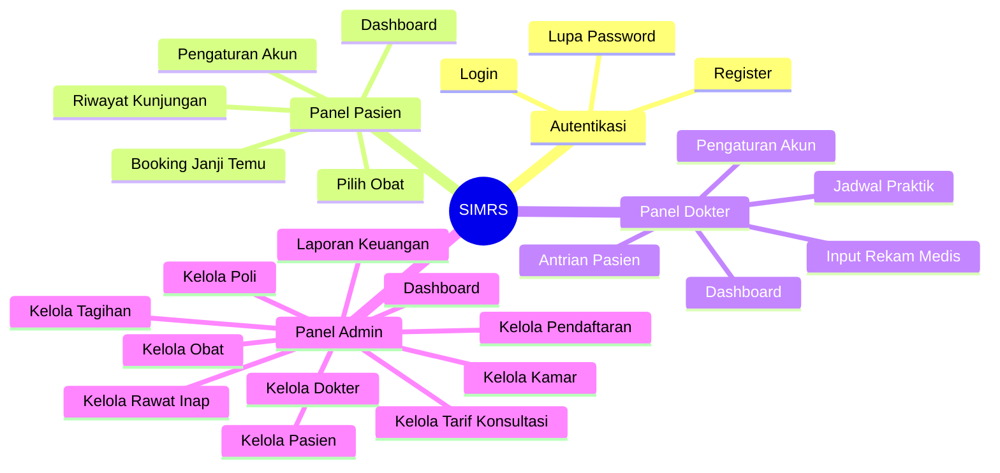
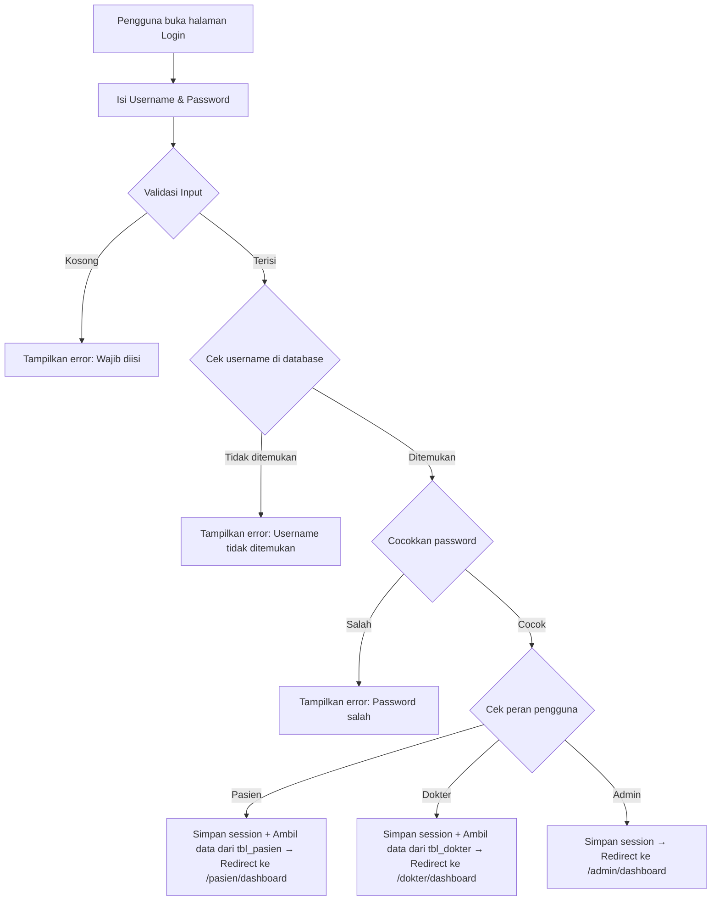
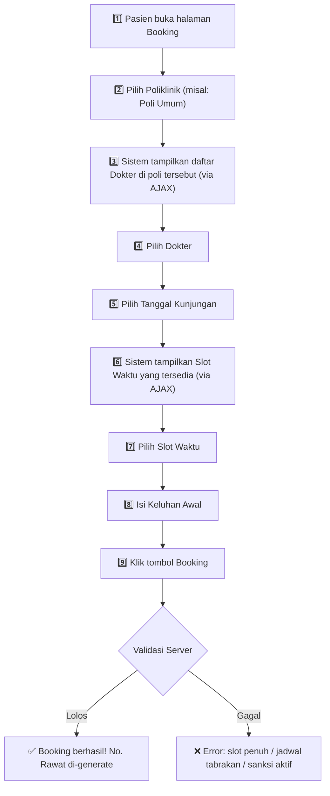
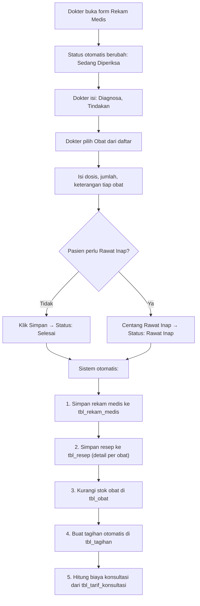
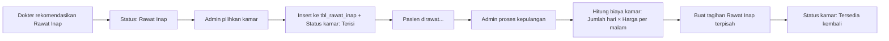
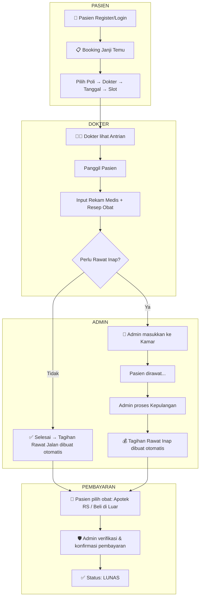
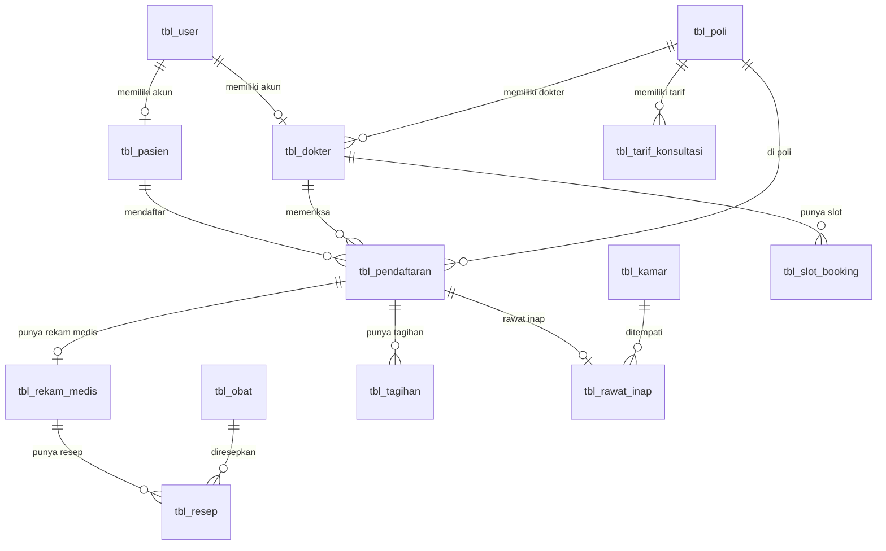

# 📋 Dokumentasi Lengkap Alur SIMRS
## Sistem Informasi Manajemen Rumah Sakit

> [!NOTE]
> Dokumen ini menjelaskan secara detail **seluruh alur kerja** dari proyek SIMRS, mulai dari Controller, Model, hingga Views. Penjelasan dibuat sesederhana mungkin agar mudah dipahami, bahkan oleh orang yang belum pernah coding sebelumnya.

---

## 📖 Daftar Isi

1. [Apa Itu Arsitektur MVC?](#-apa-itu-arsitektur-mvc)
2. [Gambaran Besar Sistem](#-gambaran-besar-sistem)
3. [Peran Pengguna (User Roles)](#-peran-pengguna-user-roles)
4. [Alur Autentikasi (Login, Register, Lupa Password)](#-alur-autentikasi)
5. [Alur Pasien](#-alur-pasien)
6. [Alur Dokter](#-alur-dokter)
7. [Alur Admin](#-alur-admin)
8. [Penjelasan Semua Model](#-penjelasan-semua-model)
9. [Penjelasan Semua Views](#-penjelasan-semua-views)
10. [Peta Routing (URL)](#-peta-routing-url)
11. [Diagram Alur Sistem](#-diagram-alur-sistem)
12. [Tabel Database yang Digunakan](#-tabel-database-yang-digunakan)

---

## 🧩 Apa Itu Arsitektur MVC?

Bayangkan kamu pergi ke restoran:

| Komponen | Analogi Restoran | Dalam SIMRS |
|----------|-----------------|-------------|
| **Model** | Dapur (tempat memasak/mengolah bahan) | Bertugas **mengambil dan menyimpan data** dari/ke database |
| **View** | Meja makan (apa yang kamu lihat) | **Halaman web** yang dilihat oleh pengguna (tampilan) |
| **Controller** | Pelayan (penghubung kamu dan dapur) | **Otak logika** yang menerima permintaan, memproses, lalu mengirim hasilnya ke tampilan |

**Alur sederhana:**
```
Pengguna klik sesuatu → Controller menerima → Controller minta data ke Model → Model ambil dari Database → Controller kirim ke View → Pengguna melihat hasilnya
```

Proyek SIMRS ini dibangun menggunakan framework **CodeIgniter 4** (PHP), yang sudah menyediakan struktur MVC secara bawaan.

---

## 🏥 Gambaran Besar Sistem

SIMRS adalah sistem berbasis web yang mengelola kegiatan operasional rumah sakit. Fitur-fitur utamanya:



---

## 👥 Peran Pengguna (User Roles)

Sistem ini memiliki **3 peran pengguna** yang masing-masing punya akses berbeda:

| Peran | Bisa Apa Saja? | Arah Redirect Setelah Login |
|-------|---------------|---------------------------|
| **Pasien** | Booking janji temu, lihat riwayat, pilih obat, ubah profil | `/pasien/dashboard` |
| **Dokter** | Lihat antrian, input rekam medis, kelola jadwal, ubah profil | `/dokter/dashboard` |
| **Admin** | Mengelola **semua data** rumah sakit (dokter, pasien, poli, obat, kamar, tagihan, laporan, dll.) | `/admin/dashboard` |

---

## 🔐 Alur Autentikasi

**File terkait:**
- Controller: [AuthController.php](file:///c:/xampp/htdocs/simrs/app/Controllers/AuthController.php)
- Views: [auth/login.php](file:///c:/xampp/htdocs/simrs/app/Views/auth/login.php), [auth/register.php](file:///c:/xampp/htdocs/simrs/app/Views/auth/register.php), [auth/forgot_password.php](file:///c:/xampp/htdocs/simrs/app/Views/auth/forgot_password.php)

### 1. Login (`/login`)

**Apa yang terjadi ketika pengguna login:**



**Secara sederhana:** Sistem mengecek username di tabel `tbl_user`, lalu mencocokkan password yang sudah di-enkripsi. Setelah cocok, sistem menyimpan informasi pengguna ke **session** (semacam "kartu identitas sementara" selama browsing), dan mengarahkan pengguna ke dashboard sesuai perannya.

### 2. Registrasi (`/register`)

**Apa yang terjadi ketika pasien baru mendaftar:**

1. Pengguna mengisi form: nama lengkap, username, password, NIK, tanggal lahir, jenis kelamin, alamat, dan opsional nomor BPJS
2. Sistem melakukan validasi:
   - Semua field wajib harus terisi
   - Password dan konfirmasi harus cocok
   - Username harus unik (belum pernah dipakai orang lain)
   - Nomor BPJS hanya boleh angka, maksimal 13 digit
3. **Pengecekan NIK yang cerdas:**
   - Jika NIK sudah ada **dan** sudah punya akun → Tolak ("NIK sudah terdaftar")
   - Jika NIK sudah ada **tapi** belum punya akun (didaftarkan offline oleh admin) → **Hubungkan** akun baru dengan rekam medis lama! ✨
   - Jika NIK belum ada → Buat pasien baru sepenuhnya
4. Sistem otomatis membuat **Nomor Rekam Medis** (No. RM) dengan format `RM-00001`, `RM-00002`, dst.
5. Data disimpan ke 2 tabel sekaligus: `tbl_user` (akun login) dan `tbl_pasien` (data pribadi)

> [!IMPORTANT]
> Fitur "Aktivasi Akun" ini sangat penting: pasien yang sebelumnya didaftarkan secara manual oleh admin bisa menghubungkan riwayat medis lamanya ke akun online yang baru!

### 3. Lupa Password (`/forgot-password`)

**Alur reset password:**

1. Pasien memasukkan username + NIK sebagai verifikasi identitas
2. Sistem mencocokkan username di `tbl_user` dan NIK di `tbl_pasien`
3. Jika cocok → Password di-update dengan yang baru
4. Fitur ini **hanya untuk Pasien** — Dokter dan Admin harus hubungi IT Support

> [!TIP]
> Alasan pakai NIK sebagai verifikasi: karena sistem ini tidak menggunakan email/SMS, jadi NIK menjadi "pertanyaan keamanan" yang hanya diketahui si pemilik akun.

---

## 🧑‍🤝‍🧑 Alur Pasien

**File terkait:**
- Controller: [PasienController.php](file:///c:/xampp/htdocs/simrs/app/Controllers/PasienController.php)
- Views: [pasien/dashboard.php](file:///c:/xampp/htdocs/simrs/app/Views/pasien/dashboard.php), [pasien/booking.php](file:///c:/xampp/htdocs/simrs/app/Views/pasien/booking.php), [pasien/riwayat.php](file:///c:/xampp/htdocs/simrs/app/Views/pasien/riwayat.php), [pasien/settings.php](file:///c:/xampp/htdocs/simrs/app/Views/pasien/settings.php)

### 1. Dashboard Pasien (`/pasien/dashboard`)

Halaman pertama yang dilihat pasien setelah login. Menampilkan:

- **Informasi pribadi** pasien (nama, No. RM)
- **Total kunjungan** — berapa kali pasien pernah ke RS
- **Kunjungan aktif** — booking yang belum selesai diperiksa
- **Rekam medis tersedia** — jumlah hasil pemeriksaan yang sudah tercatat
- **Kunjungan terakhir** — detail kunjungan paling baru (dokter siapa, poli apa)

**Cara kerjanya:** Controller mengambil data dari `tbl_pasien`, `tbl_pendaftaran`, dan `tbl_rekam_medis`, lalu mengirimnya ke view untuk ditampilkan.

### 2. Booking Janji Temu (`/pasien/booking`)

Ini adalah fitur utama pasien — membuat janji temu ke dokter.

**Alur step-by-step:**



**Fitur-fitur canggih di balik layar:**

| Fitur | Penjelasan |
|-------|-----------|
| **AJAX Dinamis** | Daftar dokter dan slot waktu dimuat tanpa reload halaman (menggunakan JavaScript AJAX) |
| **Sistem Kuota Slot** | Setiap slot waktu punya batas kuota (misal: 5 pasien per jam). Kalau penuh, slot otomatis ditandai "penuh" |
| **Anti-Duplikasi** | Pasien tidak bisa booking 2x ke dokter yang sama di hari yang sama |
| **Anti-Tabrakan Jadwal** | Pasien tidak bisa booking di jam yang sama pada hari yang sama (walau beda dokter) |
| **Sanksi No-Show** | Kalau pasien sudah 3 kali "Tidak Hadir", akunnya ditangguhkan sementara |
| **Batas Booking Aktif** | Maksimal 3 booking aktif (belum selesai) — ini mencegah pasien "menimbun" jadwal |
| **Validasi Tanggal** | Tidak bisa booking di masa lalu, hari Minggu, atau lebih dari 30 hari ke depan |

**Nomor Rawat:** Saat booking berhasil, sistem otomatis membuat Nomor Rawat unik dengan format `RWT-YYYYMMDD-XXX` (contoh: `RWT-20260602-001`). Nomor ini menjadi "tiket" kunjungan pasien.

### 3. Riwayat Kunjungan (`/pasien/riwayat`)

Halaman ini menampilkan **semua riwayat** kunjungan pasien, lengkap dengan:

- **Daftar kunjungan** (tanggal, dokter, poli, status)
- **Rekam medis** (diagnosa, tindakan, resep obat)
- **Tagihan & status pembayaran**
- **Pilihan obat** (Apotek RS atau Beli di Luar)

**Alur pengambilan data (cukup kompleks!):**

1. Ambil semua pendaftaran pasien dari `tbl_pendaftaran` + JOIN dengan `tbl_dokter` dan `tbl_poli`
2. Ambil semua rekam medis dari `tbl_rekam_medis` + JOIN dengan pendaftaran
3. Ambil semua resep obat dari `tbl_resep` + JOIN dengan `tbl_obat`, lalu kelompokkan per rekam medis
4. Ambil semua tagihan dari `tbl_tagihan`, lalu petakan ke masing-masing kunjungan

### 4. Batalkan Booking (`/pasien/booking/batal/{no_rawat}`)

Pasien bisa membatalkan booking yang statusnya masih "Belum Diperiksa":

1. Sistem memverifikasi booking milik pasien yang bersangkutan
2. Status diubah menjadi "Batal"
3. Kuota slot waktu dikurangi 1 (supaya slot bisa dipakai orang lain)

### 5. Pilih Obat (`/pasien/tagihan/pilih-obat/{id_tagihan}`)

Setelah selesai diperiksa, pasien bisa memilih mau beli obat di mana:

- **"Apotek RS"** → Biaya obat otomatis dihitung dan ditambahkan ke tagihan
- **"Beli di Luar"** → Biaya obat = Rp 0 (pasien beli sendiri di apotek luar)

Pilihan ini hanya bisa dilakukan **satu kali** dan tidak bisa diubah.

### 6. Pengaturan Akun (`/pasien/settings`)

Pasien bisa mengubah:
- Nama lengkap
- Password (opsional)

Data diperbarui di 2 tabel sekaligus: `tbl_pasien` dan `tbl_user`.

---

## 👨‍⚕️ Alur Dokter

**File terkait:**
- Controller: [DokterDashboardController.php](file:///c:/xampp/htdocs/simrs/app/Controllers/DokterDashboardController.php)
- Views: [dokter/dashboard.php](file:///c:/xampp/htdocs/simrs/app/Views/dokter/dashboard.php), [dokter/antrian.php](file:///c:/xampp/htdocs/simrs/app/Views/dokter/antrian.php), [dokter/jadwal.php](file:///c:/xampp/htdocs/simrs/app/Views/dokter/jadwal.php), [dokter/input_rekam_medis.php](file:///c:/xampp/htdocs/simrs/app/Views/dokter/input_rekam_medis.php), [dokter/settings.php](file:///c:/xampp/htdocs/simrs/app/Views/dokter/settings.php)

### 1. Dashboard Dokter (`/dokter/dashboard`)

Menampilkan ringkasan hari ini:
- **Jadwal hari ini** — daftar pasien yang akan diperiksa
- **Total pasien hari ini**
- **Belum diperiksa** — yang masih menunggu
- **Selesai** — yang sudah ditangani

### 2. Antrian Pasien (`/dokter/antrian`)

Menampilkan antrian pasien yang statusnya "Belum Diperiksa" atau "Sedang Diperiksa" untuk hari ini. Dokter bisa:

- **Panggil Pasien** → Mengubah status menjadi "Sedang Diperiksa"
- **Tandai Tidak Hadir** → Jika pasien tidak datang
- **Input Rekam Medis** → Membuka form pemeriksaan

> [!IMPORTANT]
> Dokter hanya bisa memanggil pasien atau input rekam medis **jika sudah memasuki waktu janji temu**. Contoh: jika booking jam 10:00, dokter tidak bisa memproses sebelum jam 10:00.

### 3. Jadwal Praktik (`/dokter/jadwal`)

Menampilkan **semua jadwal** pasien (tidak hanya hari ini). Bisa difilter berdasarkan tanggal. Data ditampilkan lengkap dengan rekam medis yang sudah ada (jika sudah diperiksa).

### 4. Input Rekam Medis (`/dokter/rekam-medis/{no_rawat}`)

Ini adalah **fitur terpenting dokter** — mencatat hasil pemeriksaan pasien.



**Hal-hal yang terjadi di balik layar saat menyimpan rekam medis:**

1. **Cek stok obat** — Sebelum menyimpan, sistem mengecek apakah semua obat yang diresepkan stoknya cukup. Jika tidak cukup, simpan dibatalkan (fail-fast).
2. **Simpan rekam medis** — Data diagnosa, tindakan, dan teks resep disimpan ke `tbl_rekam_medis`
3. **Simpan resep terstruktur** — Detail tiap obat (id_obat, dosis, jumlah, keterangan) disimpan ke `tbl_resep`
4. **Kurangi stok obat** — Stok di `tbl_obat` otomatis berkurang sesuai jumlah yang diresepkan
5. **Buat tagihan otomatis** — Tagihan dibuat di `tbl_tagihan` dengan rincian:
   - Biaya konsultasi (dari `tbl_tarif_konsultasi` sesuai poli dokter)
   - Biaya obat (dihitung dari harga × jumlah)
   - Status default: "Belum Lunas"

### 5. Rekomendasi Rawat Inap

Jika dokter menilai pasien perlu rawat inap:
- Dokter bisa mencentang opsi "Rawat Inap" saat menyimpan rekam medis
- Atau mengklik tombol terpisah di halaman antrian
- Status pendaftaran berubah menjadi "Rawat Inap"
- Admin kemudian yang akan memasukkan pasien ke kamar

### 6. Pengaturan Akun Dokter (`/dokter/settings`)

Dokter bisa mengubah:
- Nama lengkap
- No. Telepon
- Jam mulai dan jam selesai praktik
- Password

---

## 🛡️ Alur Admin

**File terkait:**
- Controller: [AdminController.php](file:///c:/xampp/htdocs/simrs/app/Controllers/AdminController.php), [KamarController.php](file:///c:/xampp/htdocs/simrs/app/Controllers/KamarController.php), [RawatInapController.php](file:///c:/xampp/htdocs/simrs/app/Controllers/RawatInapController.php), [TarifKonsultasiController.php](file:///c:/xampp/htdocs/simrs/app/Controllers/TarifKonsultasiController.php)
- Views: Semua file di folder [admin/](file:///c:/xampp/htdocs/simrs/app/Views/admin)

### 1. Dashboard Admin (`/admin/dashboard`)

Menampilkan ringkasan seluruh rumah sakit:
- Total dokter, pasien, dan poliklinik
- Kamar yang tersedia
- Jumlah pendaftaran bulan ini
- Rekam medis terbaru (5 terakhir)
- Jadwal hari ini (10 teratas)

### 2. Kelola Dokter (`/admin/dokter`)

Admin bisa **menambah, mengedit, dan menghapus** data dokter.

**Saat menambah dokter:**
1. Admin mengisi data: nama, poli, no. telp, jam praktik, kuota per slot
2. Admin juga membuat **akun login** untuk dokter (username + password)
3. Sistem menyimpan data ke 2 tabel dalam satu transaksi:
   - `tbl_user` (akun login dengan level "Dokter")
   - `tbl_dokter` (data profil dokter + foreign key ke tbl_user)

**Saat menghapus dokter:**
- Data dokter dihapus dari `tbl_dokter` (CASCADE akan menghapus data terkait di tabel lain)
- Akun login juga dihapus dari `tbl_user`

### 3. Kelola Poliklinik (`/admin/poli`)

CRUD sederhana untuk data poliklinik:
- **Nama Poli** (misal: Poli Umum, Poli Gigi, Poli Anak)
- **Gedung** (lokasi gedung)
- Menampilkan jumlah dokter per poli

### 4. Kelola Pasien (`/admin/pasien`)

Admin bisa mengelola data pasien (termasuk mendaftarkan pasien **offline**):

**Saat menambah pasien secara offline:**
1. Admin mengisi: NIK, nama, tanggal lahir, jenis kelamin, alamat, no. BPJS
2. Sistem mengecek NIK agar tidak duplikat
3. Nomor Rekam Medis (No. RM) otomatis di-generate
4. **Catatan:** Pasien yang didaftarkan offline **belum punya akun login** (`id_user = NULL`). Mereka bisa mengaktifkan akun nanti melalui halaman registrasi online.

**Fitur Cek NIK (AJAX):** Admin bisa mengecek secara real-time apakah NIK sudah terdaftar, tanpa harus submit form.

### 5. Kelola Pendaftaran & Janji Temu (`/admin/pendaftaran`)

Admin bisa:
- **Melihat** semua pendaftaran (filter berdasarkan tanggal dan dokter)
- **Mendaftarkan pasien walk-in** (datang langsung tanpa booking online)
- **Membatalkan** pendaftaran (status → "Batal", kuota slot dikembalikan)
- **Reschedule** — memindahkan jadwal ke tanggal/dokter/slot lain:
  1. Kuota slot lama dikurangi
  2. Kuota slot baru ditambah
  3. Data pendaftaran diperbarui

### 6. Kelola Obat (`/admin/obat`)

CRUD untuk data obat:
- Nama obat, satuan (tablet, kapsul, botol, dll.), stok, dan harga
- Stok otomatis berkurang saat dokter meresepkan obat

### 7. Kelola Kamar (`/admin/kamar`)

Mengelola kamar rawat inap:
- Nama kamar, kelas (VIP, Kelas 1, 2, 3), harga per malam
- Status: "Tersedia" atau "Terisi"
- Kamar yang sedang terisi **tidak bisa diedit**

### 8. Kelola Rawat Inap (`/admin/rawat-inap`)

**File Controller:** [RawatInapController.php](file:///c:/xampp/htdocs/simrs/app/Controllers/RawatInapController.php)

Halaman ini punya **3 tab:**

| Tab | Menampilkan Apa? |
|-----|-----------------|
| **Perlu Masuk Kamar** | Pasien yang status-nya "Rawat Inap" tapi belum dimasukkan ke kamar |
| **Sedang Dirawat** | Pasien yang saat ini menempati kamar (+ lama hari dirawat) |
| **Riwayat** | Pasien yang sudah pulang |

**Alur Rawat Inap:**



**Saat pasien pulang:**
- Total hari dirawat dihitung otomatis
- Biaya kamar = total hari × harga per malam
- Tagihan rawat inap **dibuat terpisah** dari tagihan rawat jalan
- Status kamar dikembalikan menjadi "Tersedia"

### 9. Kelola Tagihan (`/admin/tagihan`)

Admin bisa:
- **Membuat tagihan baru** untuk kunjungan yang belum ada tagihannya
- **Mengedit tagihan** — mengubah jenis bayar, status, pilihan obat
- **Toggle status** — mengubah "Belum Lunas" ↔ "Lunas" dengan satu klik
- **Mengatur pilihan obat** — Admin juga bisa mengatur pilihan obat ("Apotek RS" atau "Beli di Luar"), yang akan menghitung ulang total biaya

**Rincian tagihan:**
- Biaya Konsultasi (dari tarif poli)
- Biaya Obat (harga × jumlah tiap obat)
- Biaya Kamar (jika rawat inap)
- Total Biaya = Konsultasi + Obat + Kamar

### 10. Kelola Tarif Konsultasi (`/admin/tarif-konsultasi`)

**File Controller:** [TarifKonsultasiController.php](file:///c:/xampp/htdocs/simrs/app/Controllers/TarifKonsultasiController.php)

Mengelola harga konsultasi per poliklinik:
- Admin bisa menambah, mengedit, dan men-toggle aktif/nonaktif tarif
- Tarif yang aktif akan otomatis digunakan saat dokter menyimpan rekam medis
- Contoh: Poli Umum = Rp 100.000, Poli Spesialis = Rp 250.000

### 11. Laporan Keuangan (`/admin/laporan`)

Fitur analitik yang menampilkan laporan keuangan rumah sakit:

**Filter yang tersedia:**
- Rentang tanggal (dari — sampai)
- Poliklinik tertentu
- Dokter tertentu
- Jenis bayar (Umum / BPJS / Asuransi)
- Status bayar (Lunas / Belum Lunas / Semua)
- Jenis kunjungan (Rawat Jalan / Rawat Inap / Semua)

**Data yang ditampilkan:**
- Ringkasan statistik: total pendapatan bulan ini, pasien dilayani, tunggakan
- Tabel detail tagihan dengan semua rincian
- Pendapatan per poli
- Pendapatan per jenis bayar

**Fitur Export CSV:** Admin bisa mengunduh laporan dalam format CSV (bisa dibuka di Excel). File CSV sudah dilengkapi BOM UTF-8 agar karakter Indonesia tampil benar.

---

## 📦 Penjelasan Semua Model

Model adalah "jembatan" antara Controller dan Database. Berikut penjelasan tiap model:

### Tabel Ringkasan Model

| Model | File | Tabel Database | Primary Key | Fungsi Utama |
|-------|------|---------------|-------------|-------------|
| [ModelUser](file:///c:/xampp/htdocs/simrs/app/Models/ModelUser.php) | `ModelUser.php` | `tbl_user` | `id_user` | Mengelola data akun login (username, password, level) |
| [DokterModel](file:///c:/xampp/htdocs/simrs/app/Models/DokterModel.php) | `DokterModel.php` | `tbl_dokter` | `id_dokter` | Mengelola data dokter + custom query JOIN dengan poli dan user |
| [PasienModel](file:///c:/xampp/htdocs/simrs/app/Models/PasienModel.php) | `PasienModel.php` | `tbl_pasien` | `no_rm` | Mengelola data pasien (NIK, nama, tanggal lahir, dll.) |
| [PoliModel](file:///c:/xampp/htdocs/simrs/app/Models/PoliModel.php) | `PoliModel.php` | `tbl_poli` | `id_poli` | Mengelola data poliklinik (nama poli, gedung) |
| [PendaftaranModel](file:///c:/xampp/htdocs/simrs/app/Models/PendaftaranModel.php) | `PendaftaranModel.php` | `tbl_pendaftaran` | `no_rawat` | Mengelola data pendaftaran/kunjungan + custom query JOIN |
| [RekamMedisModel](file:///c:/xampp/htdocs/simrs/app/Models/RekamMedisModel.php) | `RekamMedisModel.php` | `tbl_rekam_medis` | `id_rm` | Mengelola rekam medis + custom query JOIN |
| [KamarModel](file:///c:/xampp/htdocs/simrs/app/Models/KamarModel.php) | `KamarModel.php` | `tbl_kamar` | `id_kamar` | Mengelola data kamar rawat inap |
| [RawatInapModel](file:///c:/xampp/htdocs/simrs/app/Models/RawatInapModel.php) | `RawatInapModel.php` | `tbl_rawat_inap` | `id_rawatinap` | Mengelola data rawat inap pasien |
| [TarifKonsultasiModel](file:///c:/xampp/htdocs/simrs/app/Models/TarifKonsultasiModel.php) | `TarifKonsultasiModel.php` | `tbl_tarif_konsultasi` | `id_tarif` | Mengelola harga konsultasi per poli |
| [LaporanModel](file:///c:/xampp/htdocs/simrs/app/Models/LaporanModel.php) | `LaporanModel.php` | `tbl_tagihan` | - | Model khusus untuk laporan keuangan (query kompleks) |

### Detail Model Penting

#### ModelUser
```
Tabel: tbl_user
Field: id_user, username, nama_lengkap, password, level_id
```
Menyimpan semua akun login. Field `level_id` menentukan peran: "Admin", "Dokter", atau "Pasien".

#### PendaftaranModel
```
Tabel: tbl_pendaftaran  
Field: no_rawat, no_rm, id_dokter, id_poli, tgl_daftar, jam_kunjungan, keluhan_awal, status_periksa, slot_waktu
Primary Key: no_rawat (VARCHAR, bukan auto-increment!)
```
Ini adalah tabel inti yang menghubungkan pasien, dokter, dan poli. `no_rawat` di-generate manual dengan format `RWT-YYYYMMDD-XXX`.

#### LaporanModel
Model yang paling kompleks, berisi **query khusus** untuk:
- `getLaporan()` — Mengambil data laporan keuangan dengan filter dinamis (tanggal, poli, dokter, jenis bayar, status, jenis kunjungan)
- `getTotalPendapatanBulanIni()` — Total pendapatan bulan berjalan (hanya yang Lunas)
- `getPasienDilayani()` — Jumlah tagihan lunas bulan ini
- `getTunggakan()` — Jumlah tagihan yang belum lunas

---

## 🖥️ Penjelasan Semua Views

Views adalah file-file PHP yang berisi kode HTML + PHP untuk menampilkan halaman web ke pengguna.

### Struktur Folder Views

```
Views/
├── auth/                          ← Halaman autentikasi
│   ├── login.php                  ← Form login
│   ├── register.php               ← Form registrasi pasien
│   └── forgot_password.php        ← Form lupa password
│
├── admin/                         ← Halaman panel admin
│   ├── layout.php                 ← Template utama admin (sidebar + header)
│   ├── dashboard.php              ← Dashboard admin (statistik)
│   ├── kelola_dokter.php          ← CRUD dokter
│   ├── kelola_pasien.php          ← CRUD pasien
│   ├── kelola_poli.php            ← CRUD poliklinik
│   ├── kelola_pendaftaran.php     ← Kelola pendaftaran & janji temu
│   ├── kelola_obat.php            ← CRUD obat
│   ├── kelola_kamar.php           ← Kelola kamar rawat inap
│   ├── kelola_rawat_inap.php      ← Kelola rawat inap (3 tab)
│   ├── kelola_tagihan.php         ← Kelola tagihan & pembayaran
│   ├── kelola_tarif_konsultasi.php← Kelola tarif konsultasi per poli
│   └── laporan.php                ← Laporan keuangan + filter + export
│
├── dokter/                        ← Halaman panel dokter
│   ├── layout.php                 ← Template utama dokter
│   ├── dashboard.php              ← Dashboard dokter (jadwal hari ini)
│   ├── antrian.php                ← Antrian pasien hari ini
│   ├── jadwal.php                 ← Jadwal praktik (semua tanggal)
│   ├── input_rekam_medis.php      ← Form input rekam medis + resep
│   └── settings.php               ← Pengaturan akun dokter
│
├── pasien/                        ← Halaman panel pasien
│   ├── layout.php                 ← Template utama pasien
│   ├── dashboard.php              ← Dashboard pasien (ringkasan)
│   ├── booking.php                ← Form booking janji temu (AJAX)
│   ├── riwayat.php                ← Riwayat kunjungan + rekam medis + tagihan
│   └── settings.php               ← Pengaturan akun pasien
│
├── template/                      ← Template layout lama (legacy)
│   ├── layout.php                 ← Layout dengan sidebar AdminLTE
│   └── template.php               ← Template halaman umum
│
├── landing.php                    ← Halaman utama website (landing page)
├── login.php                      ← Halaman login (legacy)
├── v_dashboard.php                ← Dashboard (legacy)
├── v_dokter.php                   ← Kelola dokter (legacy)
├── v_pasien.php                   ← Kelola pasien (legacy)
├── v_pendaftaran.php              ← Pendaftaran (legacy)
├── v_poli.php                     ← Kelola poli (legacy)
├── v_rekam_medis.php              ← Rekam medis (legacy)
├── v_rekam_medis_cetak.php        ← Cetak rekam medis
├── v_rekam_medis_input.php        ← Input rekam medis (legacy)
└── welcome_message.php            ← Halaman welcome CodeIgniter
```

> [!NOTE]
> File-file yang ditandai **(legacy)** adalah halaman-halaman lama dari versi awal sistem. Sistem saat ini sudah menggunakan halaman-halaman baru di dalam folder `admin/`, `dokter/`, dan `pasien/`.

### Sistem Layout/Template

Setiap panel (admin, dokter, pasien) punya file **layout.php** masing-masing yang berfungsi sebagai "bingkai" halaman:
- **Header** — navbar dengan nama pengguna dan tombol logout
- **Sidebar** — menu navigasi sesuai peran
- **Content** — area konten yang diisi oleh halaman spesifik

---

## 🗺️ Peta Routing (URL)

Routing adalah "peta" yang menghubungkan URL yang diketik pengguna ke fungsi Controller yang tepat.

**File:** [Routes.php](file:///c:/xampp/htdocs/simrs/app/Config/Routes.php)

### Halaman Publik (Tanpa Login)

| URL | Method | Controller → Fungsi | Keterangan |
|-----|--------|-------------------|-----------|
| `/` | GET | `LandingController::index` | Landing page |
| `/login` | GET | `AuthController::login` | Tampilkan form login |
| `/login` | POST | `AuthController::attemptLogin` | Proses login |
| `/register` | GET | `AuthController::register` | Tampilkan form registrasi |
| `/register` | POST | `AuthController::attemptRegister` | Proses registrasi |
| `/forgot-password` | GET | `AuthController::forgotPassword` | Form lupa password |
| `/forgot-password` | POST | `AuthController::attemptForgotPassword` | Proses reset password |
| `/logout` | GET | `AuthController::logout` | Logout |

### URL Pasien

| URL | Method | Controller → Fungsi | Keterangan |
|-----|--------|-------------------|-----------|
| `/pasien/dashboard` | GET | `PasienController::dashboard` | Dashboard pasien |
| `/pasien/booking` | GET | `PasienController::booking` | Halaman booking |
| `/pasien/booking/dokter` | GET | `PasienController::getDokterByPoli` | AJAX: ambil dokter per poli |
| `/pasien/booking/slot` | GET | `PasienController::getSlotWaktu` | AJAX: ambil slot waktu |
| `/pasien/booking/check-limits` | GET | `PasienController::checkLimits` | AJAX: cek sanksi & limit |
| `/pasien/booking/store` | POST | `PasienController::storeBooking` | Simpan booking |
| `/pasien/booking/batal/{no_rawat}` | GET | `PasienController::batalBooking` | Batalkan booking |
| `/pasien/riwayat` | GET | `PasienController::riwayat` | Riwayat kunjungan |
| `/pasien/settings` | GET | `PasienController::settings` | Halaman pengaturan |
| `/pasien/settings/update` | POST | `PasienController::updateSettings` | Update pengaturan (AJAX) |
| `/pasien/tagihan/pilih-obat/{id}` | POST | `PasienController::pilihObat` | Pilih obat (AJAX) |

### URL Dokter

| URL | Method | Controller → Fungsi | Keterangan |
|-----|--------|-------------------|-----------|
| `/dokter/dashboard` | GET | `DokterDashboardController::dashboard` | Dashboard dokter |
| `/dokter/antrian` | GET | `DokterDashboardController::antrian` | Antrian pasien hari ini |
| `/dokter/jadwal` | GET | `DokterDashboardController::jadwal` | Jadwal praktik |
| `/dokter/panggil/{no_rawat}` | GET | `DokterDashboardController::panggilPasien` | Panggil pasien |
| `/dokter/tidak-hadir/{no_rawat}` | GET | `DokterDashboardController::tidakHadirPasien` | Tandai tidak hadir |
| `/dokter/rekam-medis/{no_rawat}` | GET | `DokterDashboardController::inputRekamMedis` | Form input rekam medis |
| `/dokter/rekam-medis/simpan` | POST | `DokterDashboardController::simpanRekamMedis` | Simpan rekam medis |
| `/dokter/settings` | GET | `DokterDashboardController::settings` | Pengaturan akun |
| `/dokter/settings/update` | POST | `DokterDashboardController::updateSettings` | Update pengaturan (AJAX) |

### URL Admin

| URL | Method | Controller → Fungsi | Keterangan |
|-----|--------|-------------------|-----------|
| `/admin/dashboard` | GET | `AdminController::dashboard` | Dashboard admin |
| `/admin/dokter` | GET | `AdminController::kelolaDokter` | Kelola dokter |
| `/admin/poli` | GET | `AdminController::kelolaPoli` | Kelola poli |
| `/admin/pasien` | GET | `AdminController::kelolaPasien` | Kelola pasien |
| `/admin/pendaftaran` | GET | `AdminController::pendaftaran` | Kelola pendaftaran |
| `/admin/obat` | GET | `AdminController::kelolaObat` | Kelola obat |
| `/admin/tagihan` | GET | `AdminController::kelolaTagihan` | Kelola tagihan |
| `/admin/kamar` | GET | `KamarController::index` | Kelola kamar |
| `/admin/rawat-inap` | GET | `RawatInapController::index` | Kelola rawat inap |
| `/admin/tarif-konsultasi` | GET | `TarifKonsultasiController::index` | Kelola tarif |
| `/admin/laporan` | GET | `AdminController::laporan` | Laporan keuangan |
| `/admin/laporan/export` | GET | `AdminController::exportLaporan` | Export CSV |

---

## 🔄 Diagram Alur Sistem

### Alur Utama: Dari Booking Sampai Pembayaran



### Alur Relasi Antar Tabel



---

## 🗄️ Tabel Database yang Digunakan

Berdasarkan analisis kode, berikut semua tabel database yang digunakan:

| No | Tabel | Keterangan | Primary Key |
|----|-------|-----------|-------------|
| 1 | `tbl_user` | Akun login semua pengguna (Admin, Dokter, Pasien) | `id_user` |
| 2 | `tbl_pasien` | Data pribadi pasien (NIK, nama, tanggal lahir, dll.) | `no_rm` |
| 3 | `tbl_dokter` | Data dokter (nama, poli, jam praktik, kuota slot) | `id_dokter` |
| 4 | `tbl_poli` | Data poliklinik (nama poli, gedung) | `id_poli` |
| 5 | `tbl_pendaftaran` | Data pendaftaran/kunjungan pasien | `no_rawat` |
| 6 | `tbl_rekam_medis` | Hasil pemeriksaan (diagnosa, tindakan, resep) | `id_rm` |
| 7 | `tbl_resep` | Detail resep obat terstruktur per rekam medis | `id_resep` |
| 8 | `tbl_obat` | Data obat (nama, satuan, stok, harga) | `id_obat` |
| 9 | `tbl_tagihan` | Tagihan & pembayaran per kunjungan | `id_tagihan` |
| 10 | `tbl_kamar` | Data kamar rawat inap (nama, kelas, harga) | `id_kamar` |
| 11 | `tbl_rawat_inap` | Data rawat inap pasien (kamar, tgl masuk/keluar) | `id_rawatinap` |
| 12 | `tbl_slot_booking` | Kuota slot waktu per dokter per hari | Composite key |
| 13 | `tbl_tarif_konsultasi` | Harga konsultasi per poliklinik | `id_tarif` |

---

## 🔒 Keamanan yang Diterapkan

| Aspek | Implementasi |
|-------|-------------|
| **Password** | Dienkripsi menggunakan `password_hash()` dengan algoritma `PASSWORD_DEFAULT` (bcrypt) |
| **Session** | Setiap halaman mengecek session untuk memastikan pengguna sudah login dan memiliki peran yang tepat |
| **Validasi Input** | Data dari form divalidasi di server (tidak hanya di browser) |
| **Transaksi Database** | Operasi yang melibatkan banyak tabel menggunakan `transStart()` dan `transComplete()` untuk menjamin konsistensi data |
| **Escape Output** | Menggunakan fungsi `esc()` untuk mencegah serangan XSS |
| **NIK Unik** | Sistem mencegah duplikasi NIK pasien |
| **Anti-Duplikasi Booking** | Multiple layer pengecekan untuk mencegah booking ganda |

---

## 📝 Catatan untuk Presentasi

> [!TIP]
> **Tips Presentasi:**
> 1. **Mulai dari gambaran besar** — Jelaskan bahwa SIMRS punya 3 peran pengguna (Pasien, Dokter, Admin)
> 2. **Demo alur utama** — Tunjukkan alur dari booking → pemeriksaan → pembayaran
> 3. **Highlight fitur unik:**
>    - Sistem kuota slot waktu yang mencegah antrian berlebihan
>    - Sanksi No-Show yang mendisiplinkan pasien
>    - Aktivasi akun yang menghubungkan rekam medis offline
>    - Tagihan otomatis yang dihitung dari tarif konsultasi + resep obat
>    - Dual-billing (tagihan rawat jalan dan rawat inap terpisah)
> 4. **Jelaskan teknologi** — CodeIgniter 4, PHP, MySQL, AJAX, Bootstrap
> 5. **Tunjukkan diagram alur** — Gunakan diagram mermaid dari dokumen ini

---

*Dokumen ini di-generate berdasarkan analisis mendalam terhadap seluruh kode sumber proyek SIMRS. Terakhir diperbarui: 2 Juni 2026.*
